# KPR MirAIe Card

A custom Lovelace card for Panasonic MirAIe smart ACs. Circular dial inspired by the
[LVGL climate-control-display](https://github.com/hareeshmu/climate-control-display)
ESPHome project — mode-colored halo, tick ring with warm/cool arc split, room-temp
needle, falling snowflakes, and pill-row popups for swing / Converti8 / features /
energy.

Designed to pair with the **[KPR MirAIe Local MQTT](../)** Home Assistant
integration in this repo.

<p align="center">
  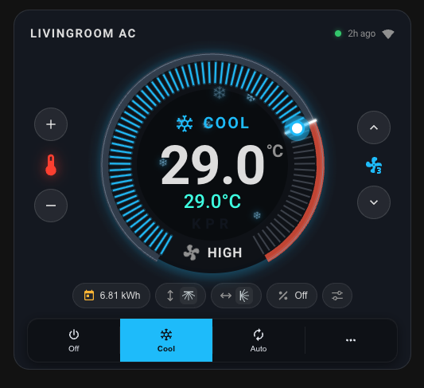
</p>

## Features

- **Circular dial** — 80-tick ring with mode-color glow, animated outer halo that
  pulses in the active mode color, cool/warm arc split at the room-temp position,
  white room-temp needle, and a draggable mode-color handle
- **Drag-to-set** — grab the handle and drag along the ring; command fires once on
  release; handle stays pinned for 2 s to hide MQTT round-trip lag
- **Responsive** — the whole dial scales fluidly (container queries) to fit narrow
  mobile layouts while keeping text proportional
- **Pill row** — compact status pills for Energy, Vertical Swing, Horizontal Swing,
  Converti8, and Features, each with its own popup
- **Mode bar** — Off / Cool / Auto + `⋯` overflow for Heat / Fan / Dry, with dark
  text on the bright active color for WCAG-AA contrast
- **Boost badge** — pulsing rocket chip above the mode label when Powerful mode is
  active
- **Snowflake particles** — 7 physics-independent flakes (fall + sway + spin) drift
  inside the dial during Cool mode
- **Header chips** — AC name (left), online status dot + last-seen + WiFi RSSI bars
  (right)
- **Auto-derived entities** — from the climate entity's slug; minimal YAML required

## Modes

<table>
<tr>
<td></td>
<td>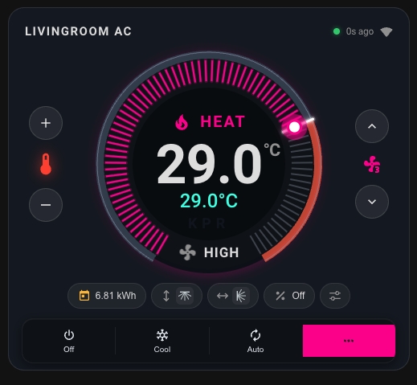</td>
</tr>
<tr>
<td align="center"><b>Cool</b> — cyan ticks, snowflakes</td>
<td align="center"><b>Heat</b> — pink ticks</td>
</tr>
<tr>
<td>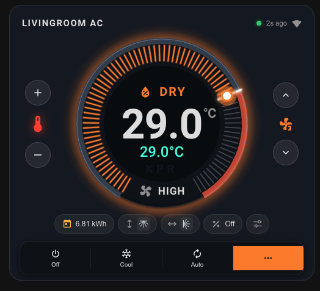</td>
<td>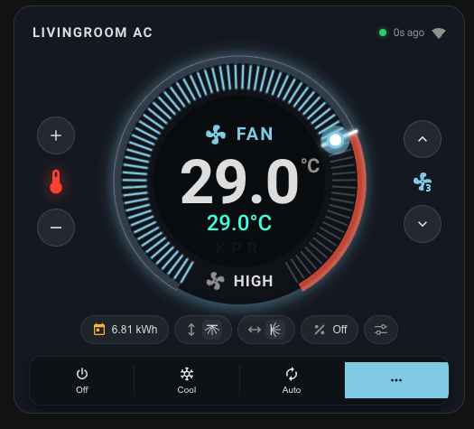</td>
</tr>
<tr>
<td align="center"><b>Dry</b> — orange ticks</td>
<td align="center"><b>Fan only</b> — sky-blue ticks</td>
</tr>
<tr>
<td>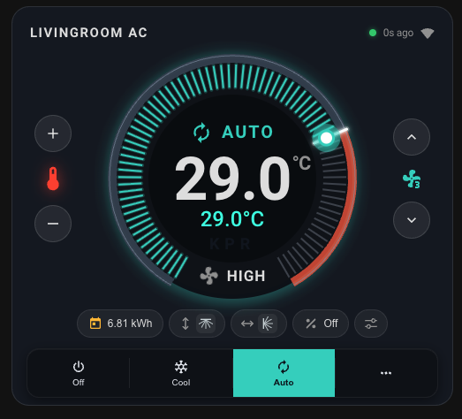</td>
<td>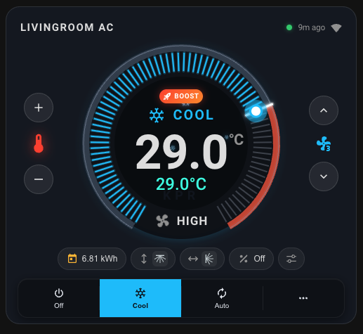</td>
</tr>
<tr>
<td align="center"><b>Auto</b> — teal ticks</td>
<td align="center"><b>Boost</b> — rocket badge above the mode label</td>
</tr>
<tr>
<td>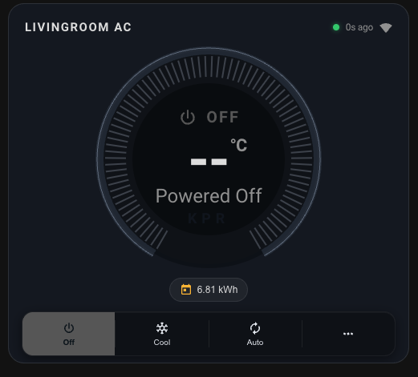</td>
<td>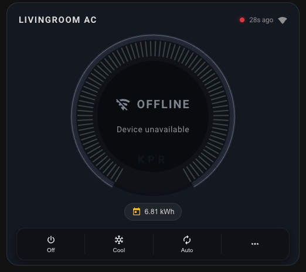</td>
</tr>
<tr>
<td align="center"><b>Powered off</b></td>
<td align="center"><b>Offline</b> — device unavailable</td>
</tr>
</table>

## Popups

<table>
<tr>
<td>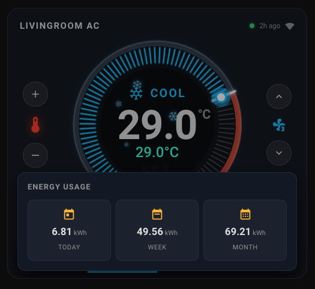</td>
<td>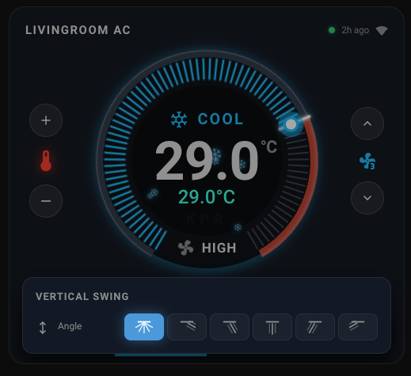</td>
</tr>
<tr>
<td align="center"><b>Energy usage</b> — Today / Week / Month</td>
<td align="center"><b>Vertical swing</b> — Auto + 5 angles</td>
</tr>
<tr>
<td>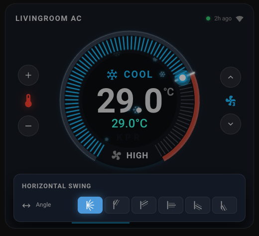</td>
<td>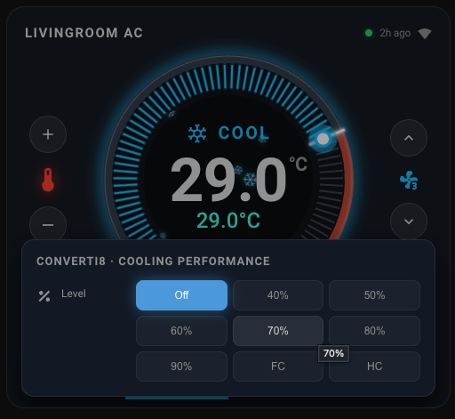</td>
</tr>
<tr>
<td align="center"><b>Horizontal swing</b> — Auto + 5 angles</td>
<td align="center"><b>Converti8</b> — Off / 40-90% / FC / HC</td>
</tr>
<tr>
<td colspan="2">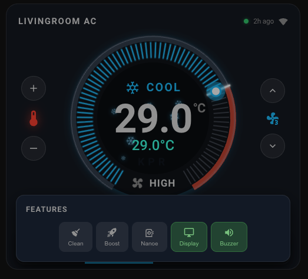</td>
</tr>
<tr>
<td align="center" colspan="2"><b>Features popup</b> — Clean / Boost / Nanoe / Display / Buzzer toggles</td>
</tr>
</table>

## Install

### Manual

1. Download the latest [`kpr-miraie-card.js`](dist/kpr-miraie-card.js) from
   `card/dist/` in this repo (or from a release).
2. Copy it to your Home Assistant `/config/www/` (or any subfolder).
3. Add it as a Lovelace resource:
   - **Settings → Dashboards → Resources → + ADD RESOURCE**
   - URL: `/local/kpr-miraie-card.js?v=1`
   - Type: **JavaScript Module**
4. Hard-refresh your browser. You should see a `KPR-MIRAIE-CARD v1.3.0` banner in
   the DevTools console confirming the load.

### HACS (frontend)

1. HACS → Frontend → Custom repositories → add this repo, category **Plugin**
2. Install **KPR MirAIe Card**
3. Hard-refresh

## Minimum YAML

Thanks to the auto-derive logic, a working card needs only two lines:

```yaml
type: custom:kpr-miraie-card
entity: climate.kpr_<deviceId>
```

The card reads the slug from the climate entity and wires up all companion
switches / selects / sensors automatically.

## Full YAML (all options)

```yaml
type: custom:kpr-miraie-card
entity: climate.kpr_05f448d0cfa6
name: Livingroom AC                 # optional; defaults to friendly_name

# Feature switches (auto-derived from climate slug if omitted)
eco_entity:       switch.kpr_05f448d0cfa6_acem   # true Eco mode (acem)
clean_entity:     switch.kpr_05f448d0cfa6_acec   # Clean mode (acec)
powerful_entity:  switch.kpr_05f448d0cfa6_acpm   # Boost / Powerful
nanoe_entity:     switch.kpr_05f448d0cfa6_acng
display_entity:   switch.kpr_05f448d0cfa6_acdc
buzzer_entity:    switch.kpr_05f448d0cfa6_bzr

# Swing / Converti (auto-derived)
v_swing_entity:   select.kpr_05f448d0cfa6_v_swing
h_swing_entity:   select.kpr_05f448d0cfa6_h_swing
converti_entity:  select.kpr_05f448d0cfa6_converti

# Energy + RSSI (auto-derived)
energy_daily_entity:   sensor.kpr_05f448d0cfa6_energy_daily
energy_weekly_entity:  sensor.kpr_05f448d0cfa6_energy_weekly
energy_monthly_entity: sensor.kpr_05f448d0cfa6_energy_monthly
rssi_entity:           sensor.kpr_05f448d0cfa6_rssi

# Section toggles
show_energy: true    # show Energy pill
show_swing:  true    # show V-Swing / H-Swing / Converti8 pills
show_extras: true    # show Features pill
```

Every line except `entity` is optional — user-supplied values override auto-derive.

## Clean vs Eco — important note

The MirAIe mobile app shows both "Clean" and "Eco mode" buttons, but they map to
**different MQTT fields**:

| App button | MQTT field | Card entity (default)              |
| ---------- | ---------- | ---------------------------------- |
| Eco mode   | `acem`     | `switch.kpr_<id>_acem` (Eco)       |
| Clean      | `acec`     | `switch.kpr_<id>_acec` (Clean)     |

Before this project, the coordinator labeled the `acec` switch as "Eco Mode" —
that was a mislabel. As of v1.3.0, the integration publishes them separately
and the card wires them to the correct popup toggles. Any pre-existing
automation that flipped your "Eco" switch was actually flipping Clean and will
keep working unchanged (same entity ID, just renamed in the UI).

## Dial geometry

- 300° sweep with a 60° gap centered at the bottom
- `startA=210°` → `endA=510°` (visual scale 16 – 34 °C to match the LVGL reference)
- Drag range clamps at the entity's real `max_temp` (usually 30 °C)
- Outer arc splits at the room-temp needle — **cool gray** from start to room temp,
  **warm orange** from room temp to end (shows "hotter than room" zone at a glance)

## Changelog

### 1.3.0
- Rewritten dial: 80 ticks, mode-color halo (5-stop radial gradient), cool/warm
  arc split, white room-temp needle, responsive cqw sizing
- Pill row with Energy / V-Swing / H-Swing / Converti / Features, each with its
  own popup
- **Clean vs Eco** fix — separate `acec` and `acem` entities with correct labels
- **Converti8** — all 9 levels (Off / 40-90% / FC / HC)
- Auto-derive companion entities from the climate slug
- Smooth drag-to-set with 2-second pin after release (hides MQTT round-trip jitter)
- Boost badge, snowflake particles, AC name header with online / RSSI indicators
- Dial-scale visual 16-34 °C (handle & room needle map to distinct angles for
  realistic room temps above 30 °C)

### 1.0.0
- Initial release

## License

Same as the parent project.
